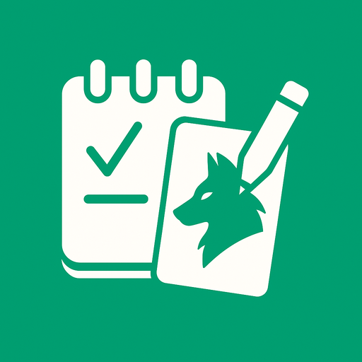

# 🐺 Anotador Loba

[](https://app.netlify.com/sites/anotador-loba/deploys)



Aplicación web progresiva (PWA) para anotar partidas del juego de cartas **Loba**. Ideal para jugar desde el celular, incluso sin conexión.

---

## ✨ Características

- Registro de jugadores, rondas y enganches.
- Cálculo automático de puntajes.
- Reordenamiento de jugadores por drag & drop.
- Resumen de partidas y almacenamiento en historial local.
- Modo PWA: instalable y usable sin conexión.
- Estilo limpio, responsive y con accesibilidad básica.
- Marca de agua discreta para reconocer al autor: _"Hecho por Maxi"_.

---

## 🚀 Ver en línea

👉 [anotador-loba.netlify.app](https://anotador-loba.netlify.app/)

---

## 🛠️ Tecnologías utilizadas

- [React](https://react.dev/)
- [Vite](https://vitejs.dev/)
- [Tailwind CSS](https://tailwindcss.com/)
- [date-fns](https://date-fns.org/)
- [dnd-kit](https://dndkit.com/)
- [lucide-react](https://lucide.dev/)
- [vite-plugin-pwa](https://vite-pwa-org.netlify.app/)

---

## 📦 Instalación local

```bash
git clone https://github.com/MaximilianoLuna7/anotador-loba.git
cd anotador-loba
npm install
npm run dev
```

---

## 📲 Instalación como app

1. Abrí el sitio en tu navegador (preferentemente Chrome).
2. Tocá en los 3 puntitos > "Instalar aplicación".
3. ¡Listo! Ya podés usarla offline.

---

## 📥 Contribuciones

Si querés sugerir mejoras, reportar errores o colaborar, ¡sos bienvenido/a!
Podés hacer un fork del repositorio y enviar un Pull Request.

---

## 📧 Contacto

**Maximiliano Luna**  
📫 [lunamaximiliano224@gmail.com](mailto:lunamaximiliano224@gmail.com)

---

_Disfrutá tu partida de Loba. ¡Anotar nunca fue tan cómodo!_
